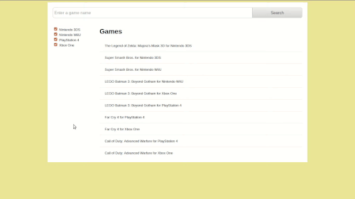

# Search Filtering #

Filter a collection of inventory items by search term and selectable
categories.

## Example Usage ##

  

## Installation ##

1. Clone this repository (`git clone https://github.com/johnisom/search-filtering`)
2. `cd` into the repository (`cd search-filtering`)
3. Open `index.html` in you favorite browser
4. Enjoy filtering some inventory items
